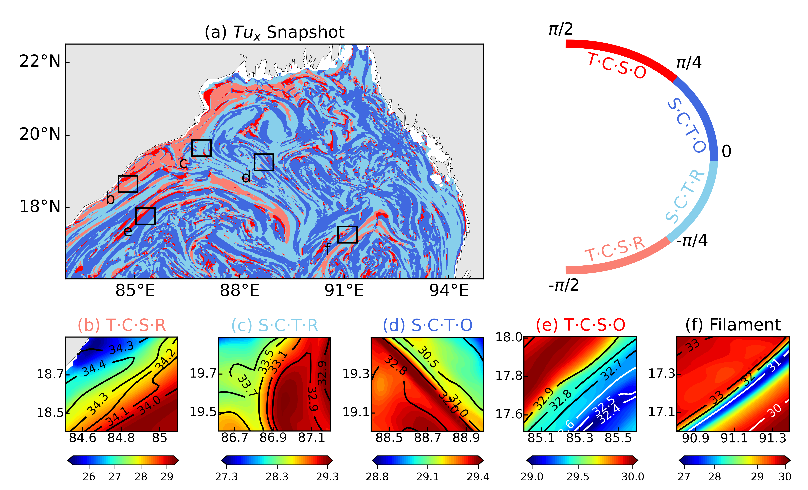
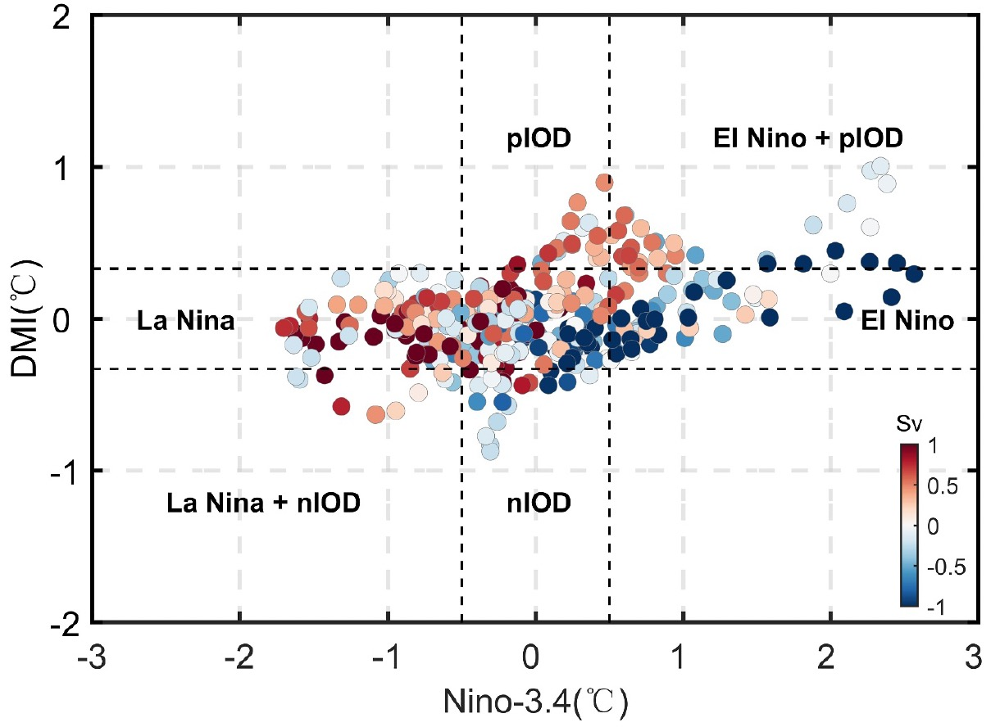
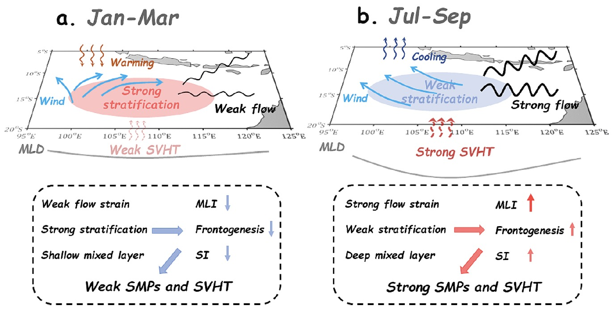
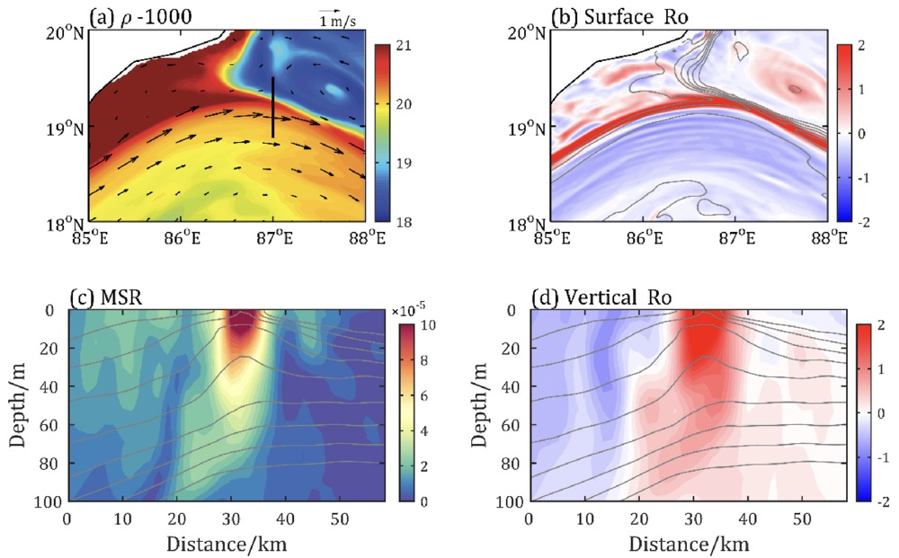
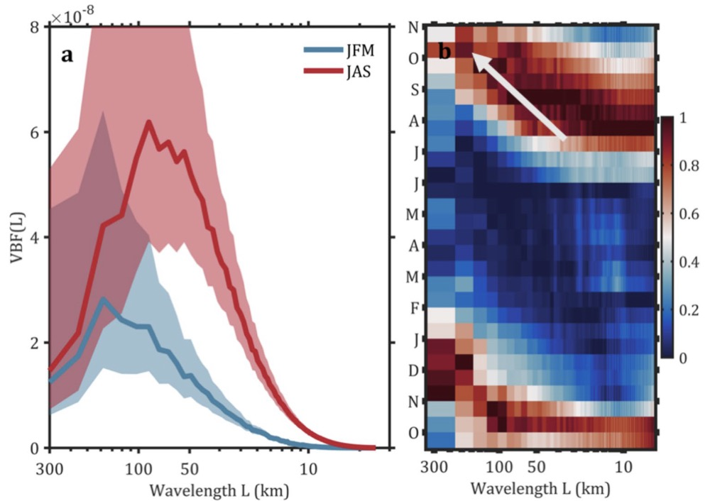
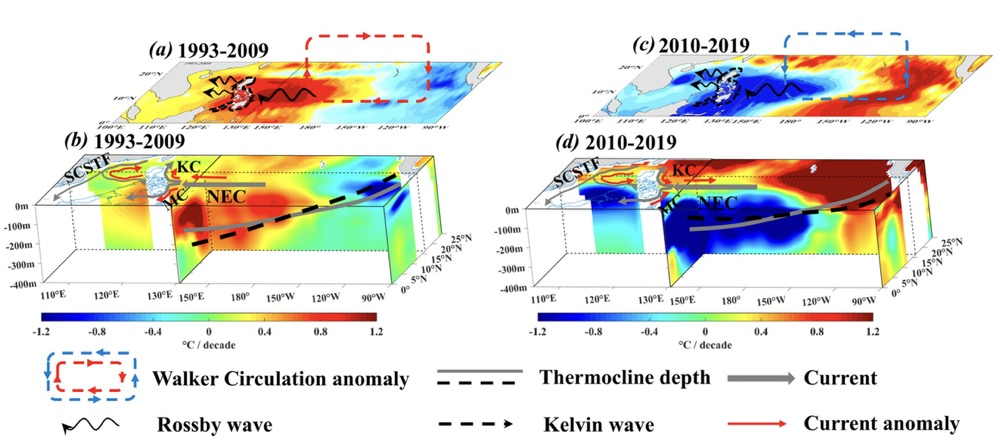
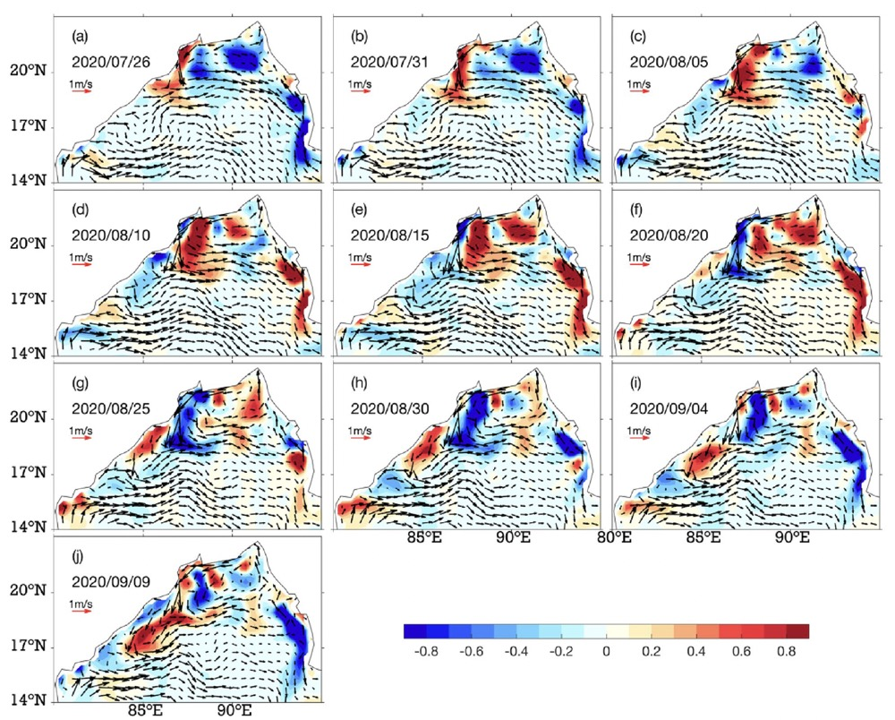
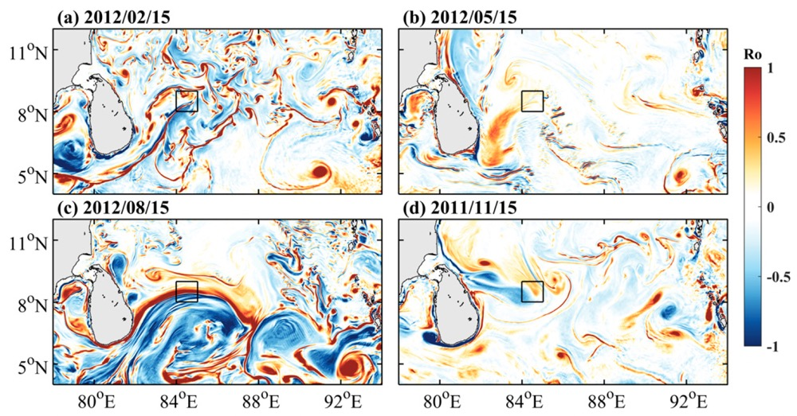
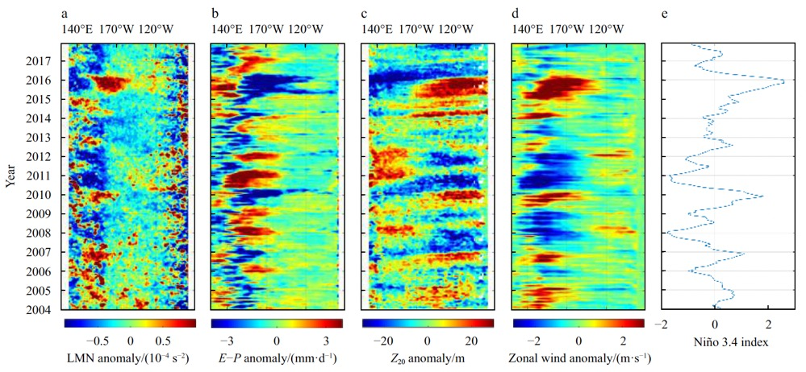
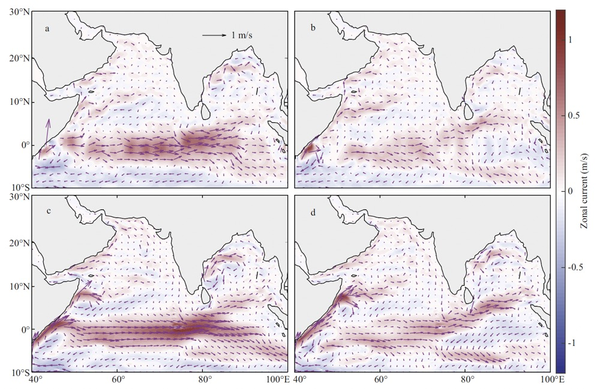








# 📖 Educations
- **2023.10 - 2024.10**: Joint Ph.D, Laboratoire d'Océanographie Physique et Spatiale (LOPS), Institut Universitaire Européen de la Mer (IUEM), Université de Bretagne Occidentale (UBO), collaborate with [Jonathan Gula](https://www.jgula.fr/), [Xavier Carton](https://www.univ-brest.fr/menu/recherche-innovation/pages-chercheurs/CARTON-Xavier/) and [Dante Campagnoli Napolitano](https://www.researchgate.net/profile/Dante-Napolitano)
- **2021.09 - 2025.06**: Doctor of Science in Marine Science, College of Oceanography, Hohai University, supervised by [Prof. Cheng Xuhua](https://hyxy.hhu.edu.cn/2017/0223/c8640a105011/page.htm)
- **2017.09 - 2020.06**: Master of Science in Marine Science, College of Oceanography, Hohai University, supervised by [Prof. Cheng Xuhua](https://hyxy.hhu.edu.cn/2017/0223/c8640a105011/page.htm)
- **2013.09 - 2017.06**: Bachelor of Engineering in Water Engineering, College of Hydrology and Water Resources, Hohai University

# 🎖 Honors and Awards
<!-- 
- **2024.03**: &nbsp;🎉🎉 Dual Champion in Badminton and Table Tennis, 1st Sinuo Cup in IMT 
-->
- **2019.10**: &nbsp;🎉🎉 Best Poster Award, South China Sea Annual Meeting 2019

# 💻 Internships and Works
<!-- 
- **2020.09-2021.02**: &nbsp;Assistant Engineer, China Earth Environment Co., Ltd.
-->
- **2025.07-now**: &nbsp;Postdoc, South China Sea Institute of Oceanology, Chinese Academy of Sciences
- **2019.03-2019.05**: &nbsp;Eastern Indian Ocean shared voyage by the National Natural Science Foundation of China

# 💬 Academic Conferences
- **2025.01**: The 7th Xiamen Symposiumon Marine Environmental Seienees (XMAS), Xiamen, **Oral**
- **2024.04**: The General Assembly 2024 of the European Geosciences Union (EGU), Vienna, **Oral**
- **2023.08**: Asia Oceania Geosciences Society (AOGS), Singapore, **Oral**
- **2023.05**: The 4th Lingfeng Student Forum, Xiamen, **Oral**
- **2022.12**: The 15th National Symposium on Ocean Data Assimilation and Numerical Simulation, Liyang, **Poster**
- **2019.11**: The 10th International Workshop on Tropical Marine Environmental Changes (MEC 2019), Guangzhou, **Poster**
- **2019.10**: South China Sea Annual Meeting (SCSAM), Sanya, **Poster**
- **2019.08**: Asia Oceania Geosciences Society (AOGS), Singapore, **Poster**
- **2018.10**: South China Sea Annual Meeting (SCSAM), Nanjing 

# 📝 Publications 

JGR-O 2024

[Characteristics of submesoscale compensated/reinforced fronts in the northern Bay of Bengal](https://doi.org/10.1029/2024JC021204)

**Duan Wei**, Cheng Xuhua, Zhou Yifei, Jonathan Gula (2024)

Journal of Geophysical Research: Oceans, 129, e2024JC021204. https://doi.org/10.1029/2024JC021204

JGR-O 2025

[Impacts of Climate Modes on Interannual Mesoscale Eddy Variability in the Southeastern Tropical Indian Ocean](https://doi.org/10.1029/2025JC022470)

Zhou Yifei, **Duan Wei**, Cheng Xuhua, Yang Chengcheng, Chen Jiajia (2025)

Journal of Geophysical Research: Oceans, 130, e2025JC022470. https://doi.org/10.1029/2025JC022470

OD 2024

[Dynamics of submesoscale processes and their influence on vertical heat transport in the southeastern tropical Indian Ocean](https://doi.org/10.1007/s10236-024-01628-5)

Zhou Yifei, **Duan Wei**, Cheng Xuhua (2024) 

Ocean Dynamics, 74, 685–702. https://doi.org/10.1007/s10236-024-01628-5

DSRI 2024

[Seasonality and potential generation mechanisms of submesoscale processes in the northern Bay of Bengal](https://doi.org/10.1016/j.dsr.2024.104318) 

Zhou Yifei, **Duan Wei**, Cao Haijin, Zhou Guidi, Cui Rong, Cheng Xuhua (2024)

Deep Sea Research Part I: Oceanographic Research Papers, 208, 104318. https://doi.org/10.1016/j.dsr.2024.104318
  

OD 2025

[Characteristics of submesoscale kinetic energy transfer in the southeast tropical Indian Ocean during 2011–2012](https://doi.org/10.1007/s10236-025-01699-y)

Zhou Yifei,Cheng Xuhua, **Duan Wei**, (2025)

Ocean Dynamics, 75, 54. https://doi.org/10.1007/s10236-025-01699-y

GRL 2023

  
[Regime Shift of the Sea Level Trend in the South China Sea Modulated by the Tropical Pacific Decadal Variability](https://doi.org/10.1029/2022GL102708)

Cheng Xuhua, Zhao Mingyu, **Duan Wei**, Jiang Long, Chen Jiajia, Yang Chengcheng, Zhou Yifei (2023)

Geophysical Research Letters, 50, e2022GL102708. https://doi.org/10.1029/2022GL102708

GL 2024

[Features and mechanisms of sea surface salinity intraseasonal variability in the Northern Bay of Bengal](https://doi.org/10.1186/s40562-024-00334-w)

Cui Rong, Cheng Xuhua, **Duan Wei**, Jiang Long, Zhou Yifei (2024) 

Geoscience Letters, 11(1), 20. https://doi.org/10.1186/s40562-024-00334-w

JPO 2023

  
[Seasonal Features and Potential Mechanisms of Submesoscale Processes in the Southern Bay of Bengal During 2011-2012](https://doi.org/10.1175/JPO-D-22-0078.1)
  
Cheng Xuhua, Li Lanman, Jing Zhiyou, Cao Haijin, Zhou Guidi, **Duan Wei**, Zhou Yifei (2023). 

Journal of Physical Oceanography, 53(4), 1199–1217. https://doi.org/10.1175/JPO-D-22-0078.1
  

AOS 2021

  
[Variability in upper-ocean salinity stratification in the tropical Pacific Ocean](https://doi.org/10.1007/s13131-020-1597-x)

**Duan Wei**, Cheng Xuhua, Zhu Xiuhua, Ma Tian (2021)

Acta Oceanologica Sinica, 40, 113-125. https://doi.org/10.1007/s13131-020-1597-x

JOL 2021

[Interannual variability of the spring Wyrtki Jet](https://doi.org/10.1007/s00343-020-9330-3)

Deng Kangping, Cheng Xuhua, Feng Tao, Ma Tian, **Duan Wei**, Chen Jiajia (2021)

Journal of Oceanology and Limnology, 39(1), 26-44. https://doi.org/10.1007/s00343-020-9330-3

